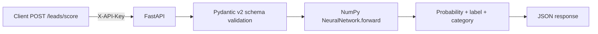

# Portfolio Note — B2B Lead Scoring API

    

## What it is — in one line

**REST API** that scores B2B leads with a **custom neural network written from scratch in NumPy** (no PyTorch/TF dependencies), classifies them as **hot / warm / cold**, and serves predictions behind **API-key auth**.

## Architecture



## Sample input → output (no need to clone — read this)

**Request**
```bash
curl -X POST http://localhost:8000/api/v1/leads/score \
  -H "X-API-Key: dev-secret" \
  -d '{"leads":[{"company_size":0.9,"budget":0.8,"engagement_score":0.7,"industry_match":1.0,"decision_maker_contact":1.0}],"threshold":0.5}'
```

**Response**
```json
{
  "total_leads": 1,
  "hot_leads": 1,
  "warm_leads": 0,
  "cold_leads": 0,
  "results": [{"index": 0, "probability": 0.8742, "label": 1, "category": "hot"}]
}
```

## Why this gets a Google AI Engineer recruiter to keep reading

| Recruiter signal | What I did |
|---|---|
| "Can they build a neural network from first principles?" | Custom forward + backward pass in NumPy — no `import torch` cheat |
| "Do they ship production APIs?" | FastAPI + Pydantic v2 schemas + dependency injection + API-key auth |
| "Do they write tests?" | `pytest tests/test_model.py` covers the model + endpoints |
| "Can they think about deployment?" | Railway/Render-ready, env-driven config, `/health` endpoint |
| "Can they design a sane API contract?" | Versioned routes (`/api/v1/...`), `/docs` Swagger, structured errors |

## Files an interviewer should open first

1. `main.py` — `B2BLeadScoringModel` class — the NumPy NN. **Open this if asked "show me ML you wrote yourself".**
2. `app/routers/leads.py` — the scoring endpoint
3. `app/core/security.py` — API-key auth dependency
4. `tests/test_model.py` — proof it works

## What I would extend in week 2 of a Google internship

- Replace NumPy NN with a stronger XGBoost baseline + SHAP for explainability
- Move from API-key to OAuth2 + scopes via Vertex AI IAM
- Add drift detection on the scoring features (Evidently)
- Deploy on **Cloud Run** with autoscaling + Cloud Logging
