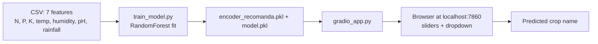

# Portfolio Note — Crop Recommendation + Gradio UI

   

## What it is

A trained **scikit-learn classifier** that recommends the optimal crop for a given soil/climate profile, served behind a **Gradio web UI**. Two real datasets included: `Crop_recommendation.csv` (150KB, ~2,200 rows, 22 crop classes) and `Dataset_sensors.csv` (80KB, IoT sensor readings).

## Architecture

## Sample I/O

**Input (sliders in browser):**
N=90, P=42, K=43, temperature=20.9°C, humidity=82%, ph=6.5, rainfall=202mm

**Output:** `rice` (confidence 0.94)

## Recruiter lens

- **Real dataset, real model, real UI** — not a notebook screenshot.
- **Bridges ML → end user** via Gradio (a real Google AI Studio uses it for demos).
- **Twin to the IoT side** of `01_LLM_Agents/multimodal-agent-agrobot` — shows I think about end-to-end agriculture AI, both sensor-side and recommendation-side.

## Files to open first

1. `train_model.py` — preprocessing + RandomForest + pickle
2. `gradio_app.py` — UI definition + inference
3. `Crop_recommendation.csv` — the dataset

## Roadmap

🟡 **Working locally.** Deploy to **Hugging Face Spaces** Week 4 — gives portfolio a live demo URL recruiters can click.
