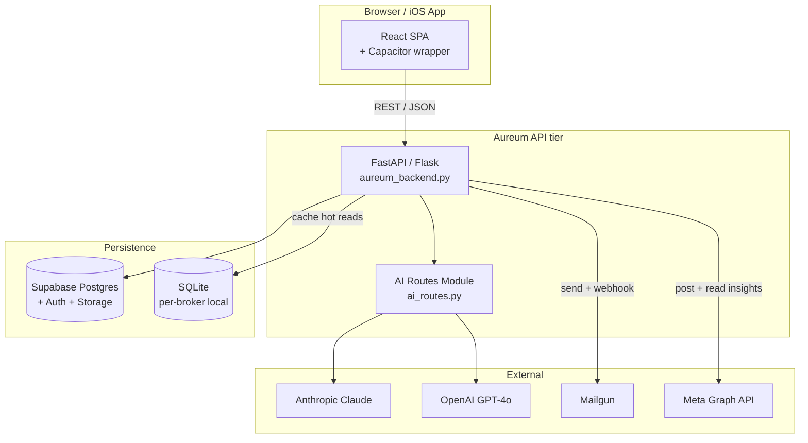

# Aureum CRM — Architecture (C4 model)

> Three-zoom-level diagram of the system, in C4 style. For deeper detail see `aureum_backend.py` and `frontend/src/`.

## L1 — System Context

```mermaid
flowchart LR
    Broker[Real Estate Broker<br/>(primary user)]
    Lead[Prospect / Lead<br/>(filling forms)]
    Aureum[(Aureum CRM<br/>SaaS)]
    LLM[LLM Vendors<br/>Claude · OpenAI]
    Email[Email Provider<br/>Mailgun / SES]
    Social[Social Networks<br/>IG · FB · LinkedIn API]

    Broker -->|manages leads + properties| Aureum
    Lead -->|submits intent| Aureum
    Aureum -->|AI drafts + scoring| LLM
    Aureum -->|sends sequences| Email
    Aureum -->|posts content| Social
    Email -.replies.-> Aureum
```

## L2 — Containers



## L3 — Component (AI Routes Module)

```mermaid
flowchart LR
    Endpoint[POST /api/ai/<task>] --> Auth[Auth + tenancy guard]
    Auth --> Cost[Per-tenant budget check]
    Cost --> Router[Prompt router<br/>(task → model + template)]
    Router --> Cache2[Prompt cache<br/>(hash of inputs)]
    Cache2 -- miss --> Vendor[Vendor SDK call]
    Cache2 -- hit --> Out[JSON response]
    Vendor --> Validator[Pydantic schema validate]
    Validator --> Out
    Vendor -.log.-> Audit[(Audit log<br/>tokens, $, latency)]
```

## Key invariants

1. **Tenant isolation** — every Supabase query filters by `broker_id` via Postgres Row-Level Security.
2. **Per-tenant AI budget** — `ai_routes.py` checks `monthly_budget_usd` before calling LLM; raises 402 Payment Required if exceeded.
3. **Prompt versioning** — each AI task has a numeric `prompt_version`; eval harness pins golden outputs so regressions are caught.
4. **No PII in logs** — request bodies redact emails / phone / addresses before hitting the audit log.

## Deployment topology (production)

```mermaid
flowchart LR
    User[User browser / iOS]
    CDN[Vercel Edge<br/>(static frontend)]
    LB[Fly.io / Cloud Run<br/>(API tier, autoscaled)]
    DB[Supabase managed Postgres<br/>(eu-west)]

    User --> CDN
    User --> LB
    LB --> DB
    LB -.async.-> Redis[(Redis<br/>job queue)]
    Redis --> Worker[Background workers<br/>(email send, social post)]
```

## Scale horizons

| Stage | What changes |
|---|---|
| **0-50 brokers** | Single Fly.io machine + Supabase free tier |
| **50-500 brokers** | Add Redis + 2 worker pods · Supabase Pro |
| **500-5,000 brokers** | Move AI routes behind Vertex AI Endpoints with regional routing · pgvector for semantic search |
| **5,000+** | Multi-region active-active · per-region Supabase replicas · LLM vendor failover |

## Open questions (would discuss in interview)

1. Move from a monorepo single `aureum_backend.py` to per-domain services? At what brokerage count is the rewrite cost justified?
2. When does it become worth fine-tuning a small private model (Llama 3.3 70B + LoRA) for the email-drafting task instead of paying GPT-4o per call?
3. Tenant-aware RAG with pgvector vs. external vendor (Pinecone, Weaviate) — at what data volume does the trade-off flip?
