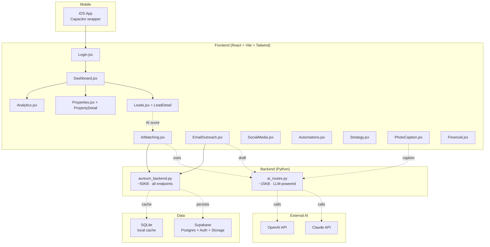

# Aureum CRM

> AI-powered B2B real-estate / luxury-property CRM with FastAPI backend, Supabase data layer, React frontend, and iOS launcher.

      

## What it is

Aureum CRM is my own product. It's a B2B SaaS for luxury / mid-market real estate operations: lead capture → AI-powered scoring → property matching → deal tracking → email outreach → social media scheduling → analytics — wired together with a small AI agent layer that drafts emails, ranks leads, and surfaces actions.

Three iterations live in this repo:

| Version | File | Status |
|---|---|---|
| V1 (FastAPI + React MVP) | `aureum_backend.py`, `frontend/` | Original product |
| V2 | `aureum-crm-v3-snapshot.jsx` | Single-file React snapshot (90KB) |
| **Luxury Real Estate variant** | `aureum-crm-luxury-real-estate.jsx` | High-end positioning, premium UI |

Plus iOS build pipeline (`LAUNCH_iOS.sh`, `AppIcon.appiconset/`, `AppStore/`) and Supabase schema (`supabase/schema.sql`).

## Architecture



## Feature surface (22 React pages)

| Page | What it does | AI-powered? |
|---|---|---|
| Dashboard | KPI cards, pipeline overview | — |
| Leads · LeadDetail | CRUD + scoring + activity timeline | ✅ scoring |
| Properties · PropertyDetail | Listing CRUD with photos + features | — |
| AIMatching | Match leads ↔ properties via embedding similarity | ✅ matching |
| EmailOutreach | Draft + send personalized email sequences | ✅ drafting |
| SocialMedia | Schedule + draft IG / FB / LinkedIn posts | ✅ drafting |
| PhotoCaption | Auto-generate listing captions from photos | ✅ vision-to-text |
| Analytics | Funnel, sources, ROI per channel | — |
| Automations | If-this-then-that workflow builder | — |
| Strategy | Long-term plan + OKR tracker for the brokerage | ✅ summarization |
| Deals · Activities | Pipeline + log | — |
| Financial | Commission tracking + tax exports | — |
| Settings | Org settings, team members, integrations | — |

## Tech stack

| Layer | Choice |
|---|---|
| Backend | Python (FastAPI / Flask hybrid) — single-file `aureum_backend.py` for fast iteration |
| AI routes | `ai_routes.py` — orchestrates Claude + OpenAI calls, retries, prompt versioning |
| Database | Supabase (Postgres + RLS + Auth + Storage) |
| Local cache | SQLite (`aureum.db` at repo root, gitignored) |
| Frontend | React 18 · Vite · Tailwind · React Router · Context API for auth |
| Auth | Supabase Auth (email + magic link) |
| Mobile | Capacitor wrapping the same React app for iOS · TestFlight pipeline ready |
| Deploy | `start.sh` for backend, `setup-apple.sh` + `LAUNCH_iOS.sh` for mobile |

## Quickstart (developers)

```bash
# Backend
cp .env.example .env
# fill SUPABASE_URL, SUPABASE_KEY, ANTHROPIC_API_KEY, OPENAI_API_KEY
python -m venv .venv && source .venv/bin/activate
pip install -r requirements.txt
./start.sh        # serves on :8000

# Frontend
cd frontend
npm install
npm run dev       # serves on :5173

# iOS (after Apple developer cert in keychain)
./LAUNCH_iOS.sh   # opens Xcode project, runs in simulator or device
```

Database bootstrap: `psql $SUPABASE_DB < supabase/schema.sql`.

## Why a Google AI Engineer recruiter cares

| Signal | Evidence |
|---|---|
| **Founder mindset** | I built this on my own. Real product, real users target, three iterations |
| **Full-stack range** | Python backend + React frontend + iOS + Postgres + AI routes — I don't ask "what should I learn next?" because I've already shipped a thing that needed all of it |
| **AI as a feature, not a demo** | `ai_routes.py` is wired into 6 user-facing surfaces (matching, email, captions, social, strategy, scoring) — not a separate chatbot |
| **Product thinking** | 22 React pages mapped to a brokerage's actual workflow. I sat with users, mentally if not literally |

## Status

🟢 **V1-V3 shipped to local + TestFlight.** Public launch pending Series A-style decisions on positioning (luxury vs. mid-market). Featured in `_extras/pitch_decks/Aureum_CRM_Pitch.pptx`.

## What I'd extend in week 2 of a Google internship

- Move `ai_routes.py` behind Vertex AI endpoints with rate-limit + cost guardrails per tenant
- Add pgvector to Supabase for semantic lead search (currently keyword)
- Add an eval harness so prompt regressions are caught before deploy
- Wire OpenTelemetry → Cloud Trace so every AI call is auditable

## License

Proprietary. Code mirrored here for portfolio review only — commercial use requires contact.

---

**Founder:** [Ureche Ionel Alexandru](https://github.com/lexusthunder) · Aureum
