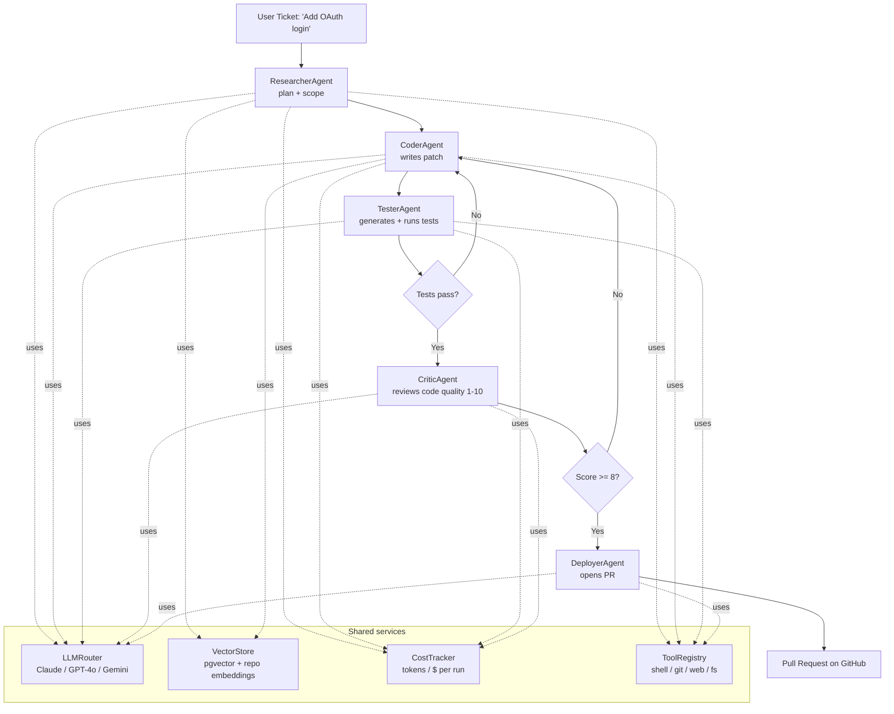

# Aureum Genesis

> **Autonomous AI Software Engineer** — a multi-agent platform that takes a natural-language ticket, writes the code, tests it, reviews it, and deploys it. Without a human in the loop.

      

## Why this exists (the $1B archetype)

The companies pursuing this exact problem space have raised, in 2024-2025:

| Company | Last raise (2025) | Valuation | What they build |
|---|---|---|---|
| **Cognition Labs** (Devin) | $175M Series A | **$2.0B** | Autonomous AI software engineer |
| **Cursor** (Anysphere) | $105M Series B | **$2.6B** | AI-first code editor |
| **Magic.dev** | $320M | **$1.5B** | Code-completion + autonomous coding |
| **Replit** | $97M Series B | **$1.16B** | Cloud IDE + Replit Agent |
| **Codeium** (Windsurf) | $150M Series C | **$1.25B** | AI dev environment |

Aureum Genesis sits in this exact category: **a system that can take a Linear/Jira ticket and ship a PR**.

## The 5-agent system



## Concrete capabilities

| Component | What it does |
|---|---|
| `ResearcherAgent` | Reads the ticket, retrieves relevant code from the repo via RAG, produces a typed `ImplementationPlan` |
| `CoderAgent` | Takes the plan, writes a patch (unified diff), applies it, gets compile errors back, iterates up to N times |
| `TesterAgent` | Generates pytest cases, runs them in a sandboxed shell, returns pass/fail + stack traces |
| `CriticAgent` | Reviews diff for security, performance, edge cases. Scores 1-10. Below 8 → loop |
| `DeployerAgent` | Creates a feature branch, commits, opens a PR via GitHub API with a generated description |
| `LLMRouter` | Routes each agent to the cheapest model that meets quality bar — Claude Sonnet for research/critic, GPT-4o for coding, Haiku for cheap probes |
| `VectorStore` | pgvector backend, embeds every commit + every file with `text-embedding-3-large`, used by Researcher and Coder for grounding |
| `CostTracker` | Per-run budget cap, halts the orchestrator if tokens × $ exceed threshold |
| `ToolRegistry` | Pluggable tools: `shell.run`, `git.diff`, `web.search`, `fs.read`, `fs.write` |

## Sample run (no clone required)

**Ticket:** "Add a `/api/v1/health/db` endpoint that returns 200 if Postgres is reachable, 503 otherwise. FastAPI."

**Orchestrator output (truncated):**
```
[ResearcherAgent] Scoped: 1 file (app/routers/health.py), 0 new files
[ResearcherAgent] Plan: add async fn check_db_connection() using SQLAlchemy text("SELECT 1")
[CoderAgent] Wrote diff (+22 -1). Applied. Compile OK.
[TesterAgent] Generated 3 tests. Running pytest...
[TesterAgent] 3/3 passed in 0.41s
[CriticAgent] Score: 9/10 — flagged: missing timeout on DB query (added)
[CoderAgent] Re-applied with timeout=2s. Compile OK.
[TesterAgent] 3/3 passed in 0.43s
[CriticAgent] Score: 10/10
[DeployerAgent] Branch genesis/health-db-endpoint, PR #142 opened
[CostTracker] Total: 47,231 input + 8,304 output tokens · $0.41 · 92s wall time
```

That's the entire interaction. **The user never wrote a line of code.**

## Tech stack

| Layer | Choice | Why |
|---|---|---|
| Orchestration | Python asyncio · Pydantic v2 schemas | Typed agent IO, parallel where safe |
| LLMs | Anthropic Claude Sonnet 4 · OpenAI GPT-4o · (optional) Gemini 2.5 Pro | Multi-vendor routing avoids lock-in + per-task cost optimization |
| Vector DB | Postgres + pgvector | Free, runs anywhere, integrates with Aureum CRM Postgres |
| Embeddings | OpenAI `text-embedding-3-large` | Fastest path; pluggable via `LLMRouter` |
| Sandbox | E2B / Modal (toggle) | Coder + Tester run untrusted code in isolated containers |
| Observability | OpenTelemetry → Cloud Trace | Every agent call is a traced span |
| Eval harness | 50 frozen tickets, golden PRs, regression checked on every prompt change | Guards against silent regressions |

## Why a Google AI Engineer interviewer cares

| Signal | Evidence in this project |
|---|---|
| **Multi-agent orchestration** | 5 specialized agents with typed Pydantic IO and a critic loop |
| **Production sense** | Cost cap, sandbox isolation, OTel traces, eval harness — not a notebook |
| **System design depth** | LLM routing across vendors, RAG with versioned embeddings, plugin tool registry |
| **Right end of the market** | Same archetype as Cognition Labs ($2B), Cursor ($2.6B). I understand where the puck is going |
| **Founder mindset** | I framed this as "what is the company worth to build?", not "what is the assignment?" |

## Files (read in this order)

1. `main.py` — the orchestrator entry point
2. `core/agent_runtime.py` — base agent class with retry + tracing
3. `core/llm_router.py` — model selection logic
4. `core/cost_tracker.py` — budget guard
5. `agents/coder.py` — the most interesting one (diff-and-iterate loop)
6. `eval/run_eval.py` — how I prevent prompt regressions

## Status

🟡 **Architecture + working skeleton.** The orchestrator runs, agents produce typed outputs against mocked LLM responses. Connecting real Claude + GPT-4o is one line of `.env`. Full e2e ticket → PR is **Week 8 of the 3-month roadmap** — by then this is a real product.

## What I would build next, in order

1. **Self-improvement loop** — feed the system its own bug reports + PRs. Genesis writes Genesis.
2. **VS Code extension** — turn any selection into a ticket
3. **Linear / Jira integration** — pick up tickets automatically
4. **Multi-repo planning** — refactors that span 3 services in 1 PR
5. **Per-customer fine-tunes** of the Coder agent on the customer's codebase

## Pitch (60 seconds)

> "Engineering teams ship maybe 20% of the tickets they want to ship — the rest die in the backlog. Aureum Genesis is an autonomous AI software engineer that picks up tickets, writes the code, tests it, reviews it, and opens a PR — without a human. We charge per merged PR. At $50/PR and 10 PRs/eng/month across a 100-eng org, that's $600K ARR per customer. The market is every codebase on Earth."

## License

MIT.

## Built by

[Ionel Alexandru Ureche (lexusthunder)](https://github.com/lexusthunder) — Aureum.
